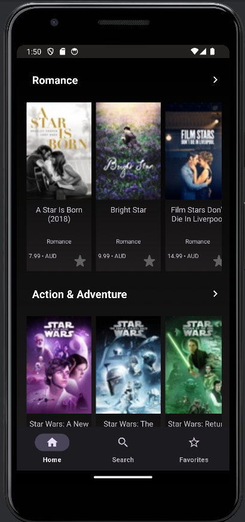

# 12052023-christian-jayme-android
# Movie Application

## Introduction

An application that utilizes the iTunes Movie API. The app allows users to explore movies, mark favorites, perform searches, and access detailed information about each movie.

## Screenshot
<p align="center">
  
  <br>
  <em>Dark mode</em>
</p>

## Features

### Favorite Movies

- Users can add movies to their favorites list from the list or detail screens.
- Movies in the favorites can be removed by:
  - Tapping the gold star icon on the home screen.
  - Clicking the "Remove from Favorites" button on the detail screen.
- Upon removal, the movie will be immediately excluded from the favorites screen.
- Favorited movies persist locally and remain accessible even when offline.
- After favoriting a movie on the detail screen, navigating back displays it as a favorite on the list screen.
This revision highlights the feature of removing movies from the favorites list, both 

### Movie Search

- Real-time search functionality triggers results as the user types.
- An empty screen displays when the search query is empty.

### Displayed Details

The app showcases the following details obtained from the iTunes Movie API:

- Track Name
- Artwork (selected size format)
- Price
- Currency
- Genre
- Long Description (available in the detail view)
- primaryGenreName
- Artist

## Technologies Used

- Kotlin
- Coroutines
- LiveData & ViewModel
- MVVM (Model-View-ViewModel)
- Repository Pattern
- Room Database
- Retrofit & OkHttp
- Dagger2/DaggerHilt
- JUnit for Unit Testing
- Gitlab CI/CD Services

## API Endpoint

The data for this app is fetched from the following URL using Retrofit:

[https://itunes.apple.com/search?term=star&country=au&media=movie](https://itunes.apple.com/search?term=star&country=au&media=movie)


## Persistence

This app utilizes SharedPreferences for data persistence:

- **Favorite Items**: Stored locally using SharedPreferences, ensuring accessibility when the app is reopened.
- **Recently Viewed Item Date**: Records the date of the most recently accessed movie, displayed in the list header for user reference.

- **Room Database**: The Room database is used to save and access data obtained from API calls. By using Room, the application ensures data availability even in offline scenarios. Here's an overview of the relevant code snippet:

#### Repository Class

```kotlin
class Repository @Inject constructor(
    val apiService: ApiService,
    val db: AppDatabase
) {
    private val movieDao = db.movieDao()

    fun getMovies(
        term: String,
        country: String,
        media: String
    ) = Utils.networkBoundResource(
        query = {
            movieDao.getAllMovies()
        },
        fetch = {
            delay(2000) // Simulating API delay
            apiService.getMovieList(term, country, media)
        },
        saveFetchResult = { movies ->
            db.withTransaction {
                movieDao.deleteAllResults()
                movieDao.insertMovies(movies)
            }
        }
    )
}
```
